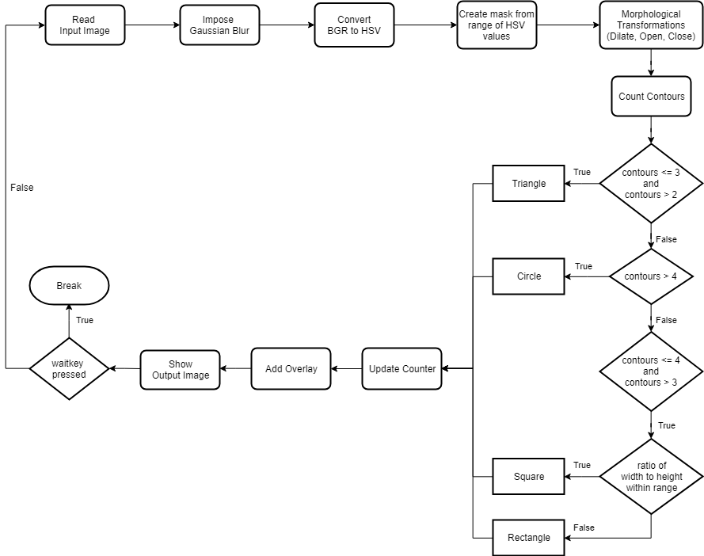
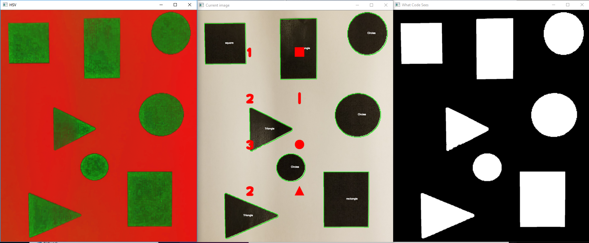

# Shape Detection
This algorithm is handled by the `shape-detection` module.

## Basic Operation
To accomplish the benthic species identification task through vision processing, Nugget Industries utilizes OpenCV for Python. First, the raw video frame passes through a Gaussian Blur; a BGR to HSV conversion; and dilation, opening, and closing morpholocical transformations. Then, all objects in the input frame within the defined HSV range are placed into a black and white mask to further improve image clarity and shape detection accuracy. Knowing that the various benthic organisms differ in shape, we use `cv2.findContours` to count each shape's contours and categorize them through the `detectsquares`, `detecttriangles`, and `detectcircles` functions. The algorithm easily identifies triangles, objects with two to three contours, and circles, objects with more than four contours. However, a different approach is necessary for distinguishing squares from rectangles as both possess four contours. To overcome this complication, we calculate the four-sided shape's ratio of width to height. If the ratio is within a defined range close to one, then that shape is characterized as a square. Otherwise, the shape is characterized as a rectangle. A counter that tracks the number of each type of shape concurrently updates. This information is then presented as an overlay on top of the live video feed by displaying the number of each type of shape next to the symbol of the corresponding shape. Finally, the video feed with the overlay is displayed alongside the HSV filter and mask of the video feed, which facilitate troubleshooting. The overlay of the processed video feed regularly updates until the `waitkey` is pressed, at which point all windows are destroyed, and the code terminates itself.

## Flowchart

## Output Image

## Source Code
TODO
